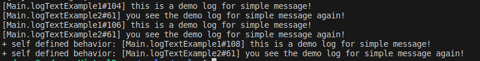

# Simple Message and LoggerT

This tutorial will show you how to use LoggerT and Simple message to log with more information in a more flexible way.

You can run this tutorial by executing the following command:

```shell
cabal new-run tutorial-loggert-simple --flag=tutorial
```

## Preamble: imports and language extensions

Since this is a literate Haskell file, we need to specify all our language
extensions and imports up front.

```haskell
{-# OPTIONS_GHC -Wno-unused-top-binds #-}
{-# LANGUAGE DataKinds                  #-}
{-# LANGUAGE DerivingStrategies         #-}
{-# LANGUAGE FlexibleContexts           #-}
{-# LANGUAGE FlexibleInstances          #-}
{-# LANGUAGE MultiParamTypeClasses      #-}
{-# LANGUAGE OverloadedStrings          #-}

module Main (main) where

import Control.Monad.Reader
import GHC.Stack
import Prelude hiding (log)
import Data.Text (Text,append)
import Colog ( LogAction, SimpleMsg(..), usingLoggerT, LoggerT, (<&),
              WithLog, cmap, logText,fmtSimpleMessage,formatWith,
              logTextStderr,logTextStdout, getLogAction
              )
```

## LoggerT

The `LoggerT` monad transformer wraps a ReaderT that keeps `LogAction` in its context. It denotes a
computation of logging. 
The `WithLog` constraint has three type parameters: the application environment,
the type of the message and the monad. The actions constraint by `WithLog` could be used as `LoggerT`.

In this example, we use a `LoggerT` monad transformer and a monadic action with `WithLog` constraint to perform log (the preferred way).

```haskell
-- logTextExample1 asks a logger from the LoggerT monad transformer, and then writes the text into the LogAction
-- it needs `HasCallStack` to print the stack information correctly
logTextExample1 :: (HasCallStack, Monad m) => LoggerT SimpleMsg m ()
logTextExample1 = 
    asks getLogAction >>= \logger ->
        logger <& SimpleMsg{ 
            simpleMsgStack = callStack
            , simpleMsgText = "this is a demo log for simple message!" 
            }

-- logTextExample2 logs the text down with the respective call stack information by the logger carried by env
-- logTextExample2 is an equivalent version of LoggerT as logTextExample1 with more features so we recommend you to use it
logTextExample2 :: WithLog env SimpleMsg m => m ()
logTextExample2 = do
    logText "you see the demo log for simple message again!"
```


## Simple Message

The simple message is data type without `severity`. It contains a callstack information and a text message.

```idris
data SimpleMsg = SimpleMsg
    { simpleMsgStack :: !CallStack
    , simpleMsgText  :: !Text
    }
```

When logging, simple messages require a format for transforming from simple messages to text. We can either use `formatWith` or its alias `cmap`
to combine it with the `LogAction`.

```haskell
logStdoutAction :: LogAction IO SimpleMsg
logStdoutAction = cmap fmtSimpleMessage logTextStdout

logStdErrAction :: LogAction IO SimpleMsg
logStdErrAction = formatWith fmtSimpleMessage logTextStderr
```

What's more, it's possible to define an own formatter.

```haskell
selfDefinedFmtSimpleMessage :: SimpleMsg -> Text
selfDefinedFmtSimpleMessage = append "+ self defined behavior: " . fmtSimpleMessage

logByOwnFormatterAction :: LogAction IO SimpleMsg
logByOwnFormatterAction = formatWith selfDefinedFmtSimpleMessage logTextStderr
```

## Running example

Now we are ready to execute those actions defined above.

```haskell
main :: IO ()
main = do
    usingLoggerT logStdoutAction logTextExample1
    usingLoggerT logStdoutAction logTextExample2
    usingLoggerT logStdErrAction logTextExample1
    usingLoggerT logStdErrAction logTextExample2
    usingLoggerT logByOwnFormatterAction logTextExample1
    usingLoggerT logByOwnFormatterAction logTextExample2
```

Run command `cabal new-run tutorial-loggert-simple --flag=tutorial`.

And the output will look like this:


