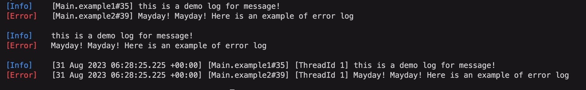

# Message and LoggerT

The previous tutorial shows how to use `LoggerT` with simple message.
This tutorial will show you how to use LoggerT together with messages with more details(e.g. severity).

You can run this tutorial by executing the following command:

```shell
cabal new-run tutorial-loggert
```

## Preamble: imports and language extensions

```haskell
{-# LANGUAGE DataKinds #-}
{-# LANGUAGE DerivingStrategies #-}
{-# LANGUAGE FlexibleContexts #-}
{-# LANGUAGE FlexibleInstances #-}
{-# LANGUAGE MultiParamTypeClasses #-}
{-# LANGUAGE OverloadedStrings #-}
{-# OPTIONS_GHC -Wno-unused-top-binds #-}

module Main (main) where

import Colog (
    LogAction,
    Message,
    Msg (..),
    WithLog,
    cmap,
    fmtMessage,
    formatWith,
    logError,
    logInfo,
    logTextStderr,
    logTextStdout,
    msgSeverity,
    msgText,
    richMessageAction,
    showSeverity,
    usingLoggerT,
 )

import Data.Text (Text)
import Prelude hiding (log)
```

## LoggerT

The `LoggerT` monad transformer wraps a ReaderT that keeps `LogAction` in its context. It denotes a
computation of logging. So you define your monadic actions with the `WithLog` constraint that allows you to perform logging.
The `Message` allows you to log with severity.

```haskell
example1 :: WithLog env Message m => m ()
example1 = do
    logInfo "this is a demo log for message!"

example2 :: WithLog env Message m => m ()
example2 = do
    logError "Mayday! Mayday! Here is an example of error log\n"
```

The `WithLog` constraint has three type parameters:

- `env` – application environment
- `msg` – type of the message
- `m` – monad

The actions constraint by `WithLog` could be used as `LoggerT`.

## Message

The message is parametrized by the `Severity` type through `Msg`, which is a general logging message data type.

```idris
type Message = Msg Severity
data Msg sev = Msg
    { msgSeverity :: !sev
    , msgStack    :: !CallStack
    , msgText     ::  Text
    }
```

Hence, besides printing the callstack, as the `LoggerT` with simple message tutorial shows, this example supports printing severity and thread id as well.

```haskell
logStdoutAction :: LogAction IO Message
logStdoutAction = cmap fmtMessage logTextStdout

fmtMessageWithoutSourceLoc :: Message -> Text
fmtMessageWithoutSourceLoc Msg{..} =
    showSeverity msgSeverity
        <> msgText

logStdErrActionWithoutStackAction :: LogAction IO Message
logStdErrActionWithoutStackAction = formatWith fmtMessageWithoutSourceLoc logTextStderr
```

## Running example

Now we are ready to execute those actions defined above.

```haskell
main :: IO ()
main = do
    usingLoggerT logStdoutAction example1
    usingLoggerT logStdoutAction example2
    usingLoggerT logStdErrActionWithoutStackAction example1
    usingLoggerT logStdErrActionWithoutStackAction example2
    usingLoggerT richMessageAction example1
    usingLoggerT richMessageAction example2
```

Run command `cabal new-run tutorial-loggert`, and the output will look like this:


